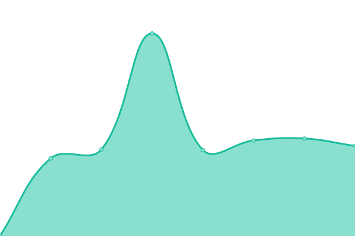
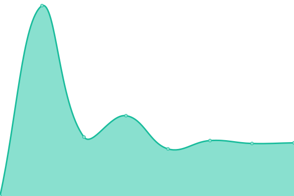

# [📈 Live Status](https://demo.upptime.js.org): <!--live status--> **🟧 Partial outage**

This repository contains the open-source uptime monitor and status page for [Roarain](https://demo.upptime.js.org), powered by [Upptime](https://github.com/upptime/upptime).

With [Upptime](https://upptime.js.org), you can get your own unlimited and free uptime monitor and status page, powered entirely by a GitHub repository. We use [Issues](https://github.com/Roarain/upptime/issues) as incident reports, [Actions](https://github.com/Roarain/upptime/actions) as uptime monitors, and [Pages](https://demo.upptime.js.org) for the status page.

<!--start: status pages-->
<!-- This summary is generated by Upptime (https://github.com/upptime/upptime) -->
<!-- Do not edit this manually, your changes will be overwritten -->
<!-- prettier-ignore -->
| URL | Status | History | Response Time | Uptime |
| --- | ------ | ------- | ------------- | ------ |
|  [lins](https://lins.sensoro.com) | 🟩 Up | [lins.yml](https://github.com/Roarain/upptime/commits/HEAD/history/lins.yml) | 

 909ms
     
 | 

<a href="https://demo.upptime.js.org/history/lins">100.00%</a>
    

|  [city](https://city.sensoro.com) | 🟥 Down | [city.yml](https://github.com/Roarain/upptime/commits/HEAD/history/city.yml) | 

 875ms
     
 | 

<a href="https://demo.upptime.js.org/history/city">0.00%</a>
    

|  [iot](https://iot.sensoro.com) | 🟩 Up | [iot.yml](https://github.com/Roarain/upptime/commits/HEAD/history/iot.yml) | 

 932ms
     
 | 

<a href="https://demo.upptime.js.org/history/iot">100.00%</a>
    

|  [ai](https://ai.sensoro.com/) | 🟩 Up | [ai.yml](https://github.com/Roarain/upptime/commits/HEAD/history/ai.yml) | 

 1055ms
     
 | 

<a href="https://demo.upptime.js.org/history/ai">100.00%</a>
    

|  [vms](https://vms-api.sensoro.com/) | 🟩 Up | [vms.yml](https://github.com/Roarain/upptime/commits/HEAD/history/vms.yml) | 

 898ms
     
 | 

<a href="https://demo.upptime.js.org/history/vms">100.00%</a>
    

|  [sensoro](https://www.sensoro.com/) | 🟩 Up | [sensoro.yml](https://github.com/Roarain/upptime/commits/HEAD/history/sensoro.yml) | 

 928ms
     
 | 

<a href="https://demo.upptime.js.org/history/sensoro">100.00%</a>
    

<!--end: status pages-->

[**Visit our status website →**](https://demo.upptime.js.org)

## 📄 License

- Powered by: [Upptime](https://github.com/upptime/upptime)
- Code: [MIT](./LICENSE) © [Roarain](https://demo.upptime.js.org)
- Data in the `./history` directory: [Open Database License](https://opendatacommons.org/licenses/odbl/1-0/)
